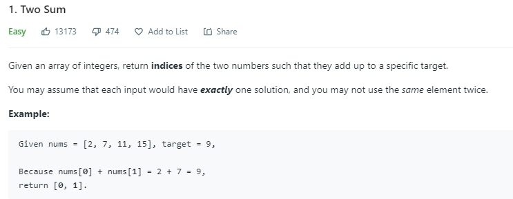

	func twoSum(nums []int, target int) []int
	{
		var dict = make(map[int]int)
	
		for i := 0; i < len(nums); i++ {
			dict[nums[i]] = i
		}
	
		var result = []int{}
	
		for i := 0; i < len(nums); i++ {
			var x = target - nums[i]
			index, ok := dict[x]
			if ok && index != i {
				result = append(result, i)
				result = append(result, index)
				return result
			}
		}
	
		return result
	}